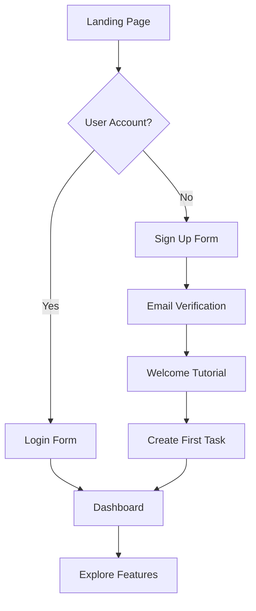
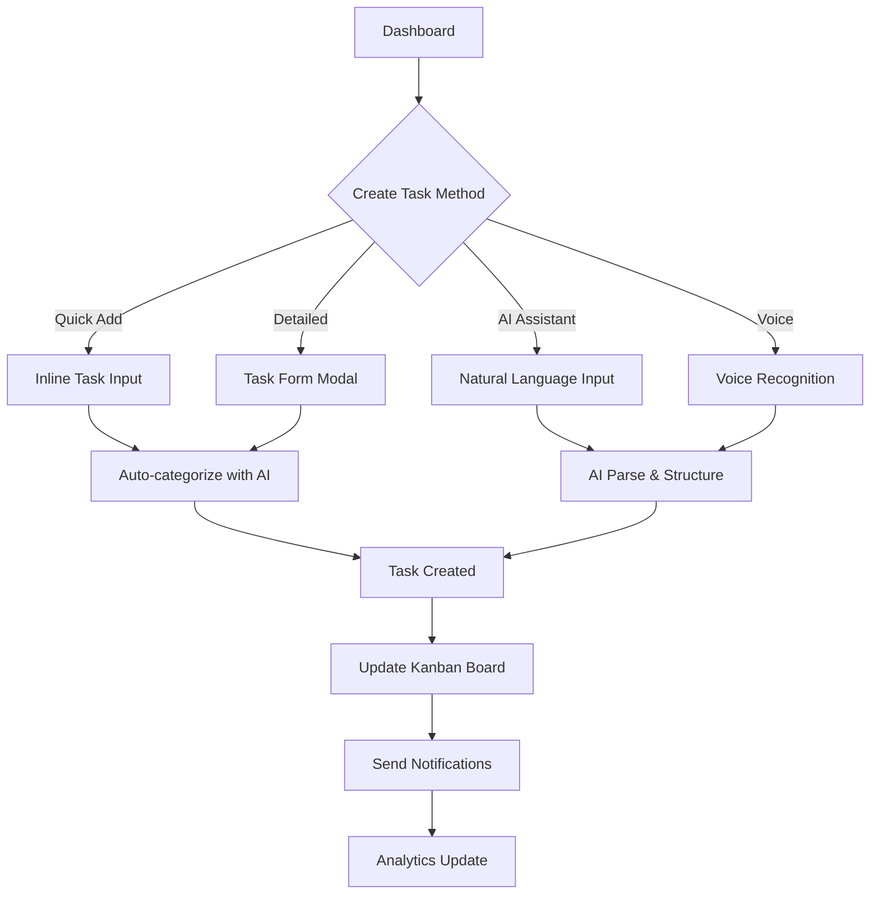
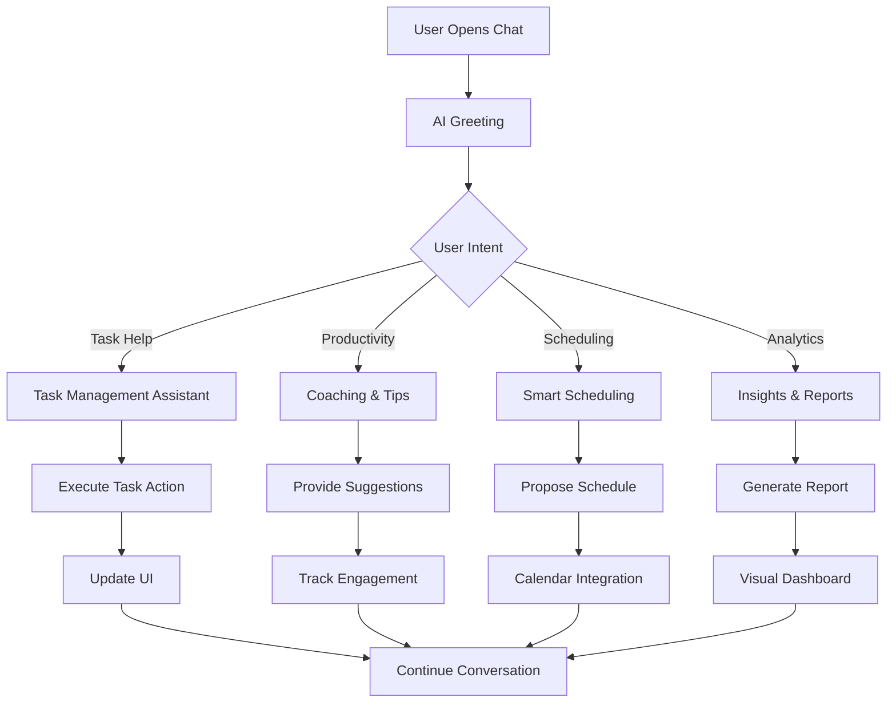
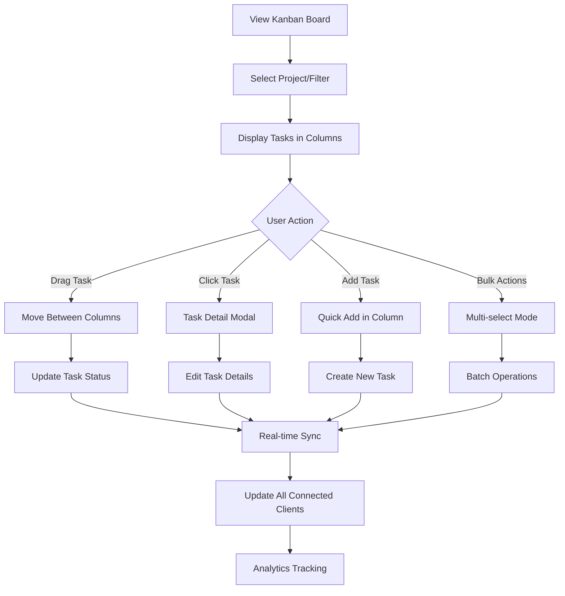
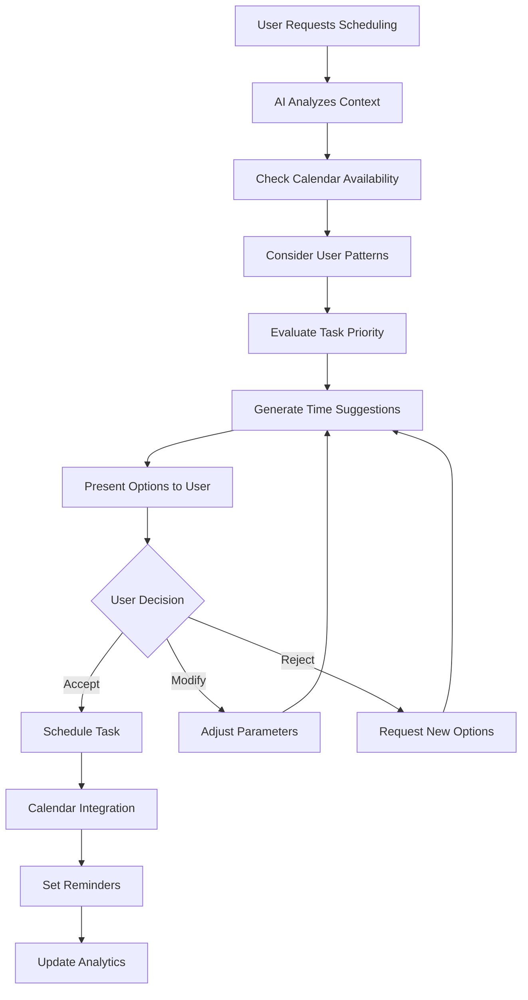
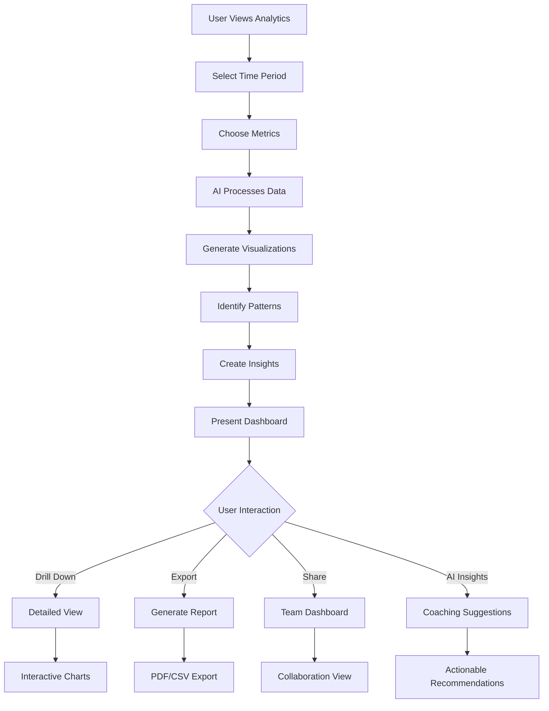
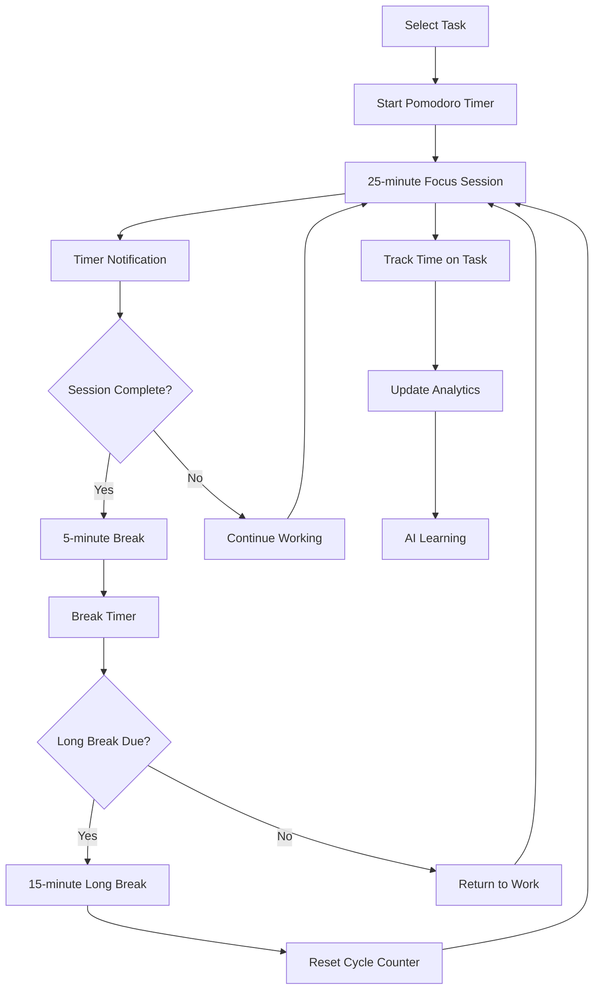
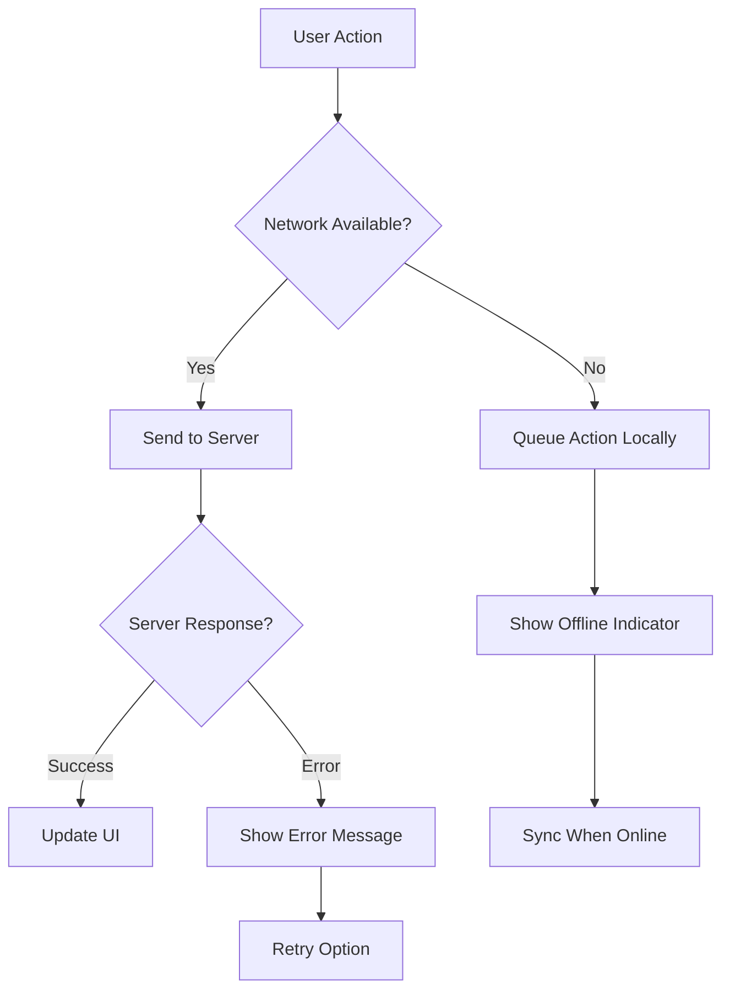

# 🔄 User Flow Diagrams

## 🎯 Core User Journeys

### 1. 🚀 User Onboarding Flow

**Key Touchpoints:**
- [ ] ✅ Compelling landing page with clear value proposition
- [ ] ✅ Frictionless signup (email + password)
- [ ] ✅ Interactive tutorial highlighting key features
- [ ] ✅ Quick win: Create first task within 30 seconds

---

### 2. 📝 Task Creation & Management Flow

**User Stories:**
- [ ] **Quick Task**: "Buy groceries" → Auto-categorized as "Personal"
- [ ] **Detailed Task**: Full form with due date, priority, project
- [ ] **Natural Language**: "Remind me to call mom tomorrow at 3pm"
- [ ] **Voice Input**: Hands-free task creation

---

### 3. 🤖 AI Assistant Interaction Flow

**AI Capabilities:**
- [ ] ✅ Context-aware responses based on user history
- [ ] ✅ Proactive suggestions for task optimization
- [ ] ✅ Natural language task manipulation
- [ ] ✅ Productivity coaching and motivation

---

### 4. 📋 Kanban Board Workflow

**Board Features:**
- [ ] ✅ Customizable columns (To Do, In Progress, Review, Done)
- [ ] ✅ Drag & drop with smooth animations
- [ ] ✅ Real-time collaboration indicators
- [ ] ✅ Bulk operations for efficiency

---

### 5. 📅 Smart Scheduling Flow

**Smart Features:**
- [ ] ✅ Learn from user scheduling patterns
- [ ] ✅ Consider energy levels and productivity windows
- [ ] ✅ Integrate with external calendars
- [ ] ✅ Automatic conflict resolution

---

### 6. 📊 Analytics & Insights Flow

**Analytics Features:**
- [ ] ✅ Task completion rates and trends
- [ ] ✅ Productivity patterns and peak hours
- [ ] ✅ Project progress and time estimates
- [ ] ✅ AI-generated insights and recommendations

---

### 7. ⏱️ Pomodoro Timer Integration

**Timer Features:**
- [ ] ✅ Customizable work/break intervals
- [ ] ✅ Task-specific time tracking
- [ ] ✅ Ambient sounds and focus music
- [ ] ✅ Productivity insights from timer data

---

## 🎨 UI/UX Considerations

### Design Principles
1. **Minimalist Interface**: Clean, distraction-free design
2. **Contextual Actions**: Right information at the right time
3. **Progressive Disclosure**: Advanced features when needed
4. **Consistent Interactions**: Familiar patterns throughout
5. **Accessibility First**: WCAG 2.1 AA compliance

### Responsive Breakpoints
- **Mobile**: 320px - 768px (Touch-optimized)
- **Tablet**: 768px - 1024px (Hybrid interactions)
- **Desktop**: 1024px+ (Keyboard shortcuts, multi-panel)

### Dark Mode Strategy
- **System Preference**: Auto-detect user preference
- **Manual Toggle**: Easy switching in header
- **Consistent Colors**: Semantic color system
- **Accessibility**: Maintain contrast ratios

### Animation Guidelines
- **Micro-interactions**: Hover states, button clicks
- **Transitions**: Smooth state changes (200-300ms)
- **Loading States**: Skeleton screens, progress indicators
- **Feedback**: Success/error animations

---

## 🔄 Error Handling & Edge Cases

### Network Issues

### Data Conflicts
- **Optimistic Updates**: Immediate UI feedback
- **Conflict Resolution**: Last-write-wins with user notification
- **Version Control**: Track changes for important data
- **Backup Strategy**: Regular data exports

This comprehensive user flow documentation ensures every interaction is thoughtfully designed for optimal user experience while maintaining technical feasibility and performance standards.